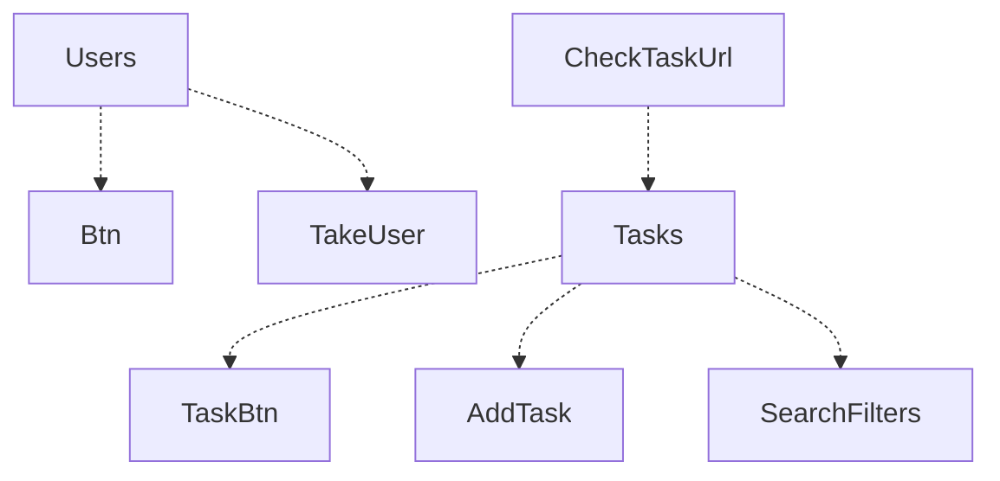
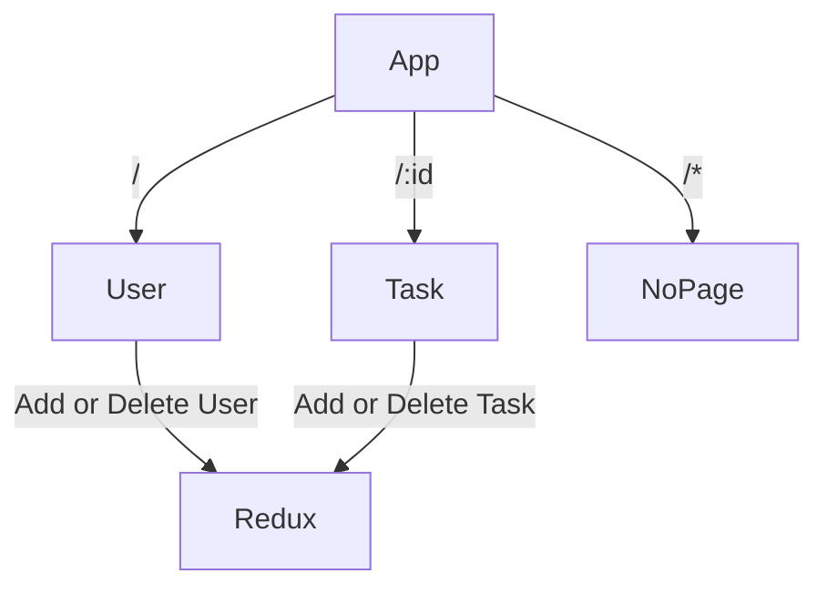

# Table of contents  
1. [Component Design](#component_design)  
2. [Routing Design](#routing_design)  
3. [Definitions](#definitions) 
## Component_Design

## Routing_Design

## Definitions
* / routes to Homepage  
* /:id routes to User Task Page  
* /* routes to Not-Page-Found  
* **User Component** It takes input from the user (by **TakeUser** Component) and add, edit & delete it to the Redux store
* **Task Component** Before Rendering, **CheckTaskUrl** Component check if URL has User-Name then render it. It's a function that returns a form that takes in a task name, status, and due date, and then adds, edit & delete that task to the user's task list in Redux store and also filter task by **SearchFilters** Component.
